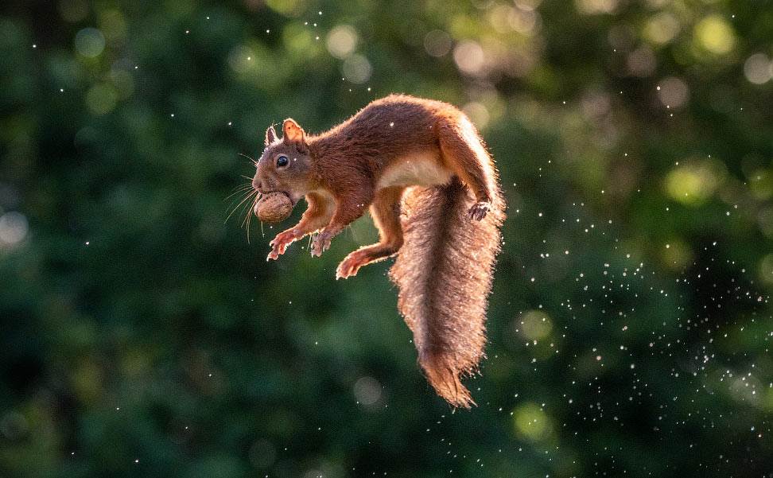
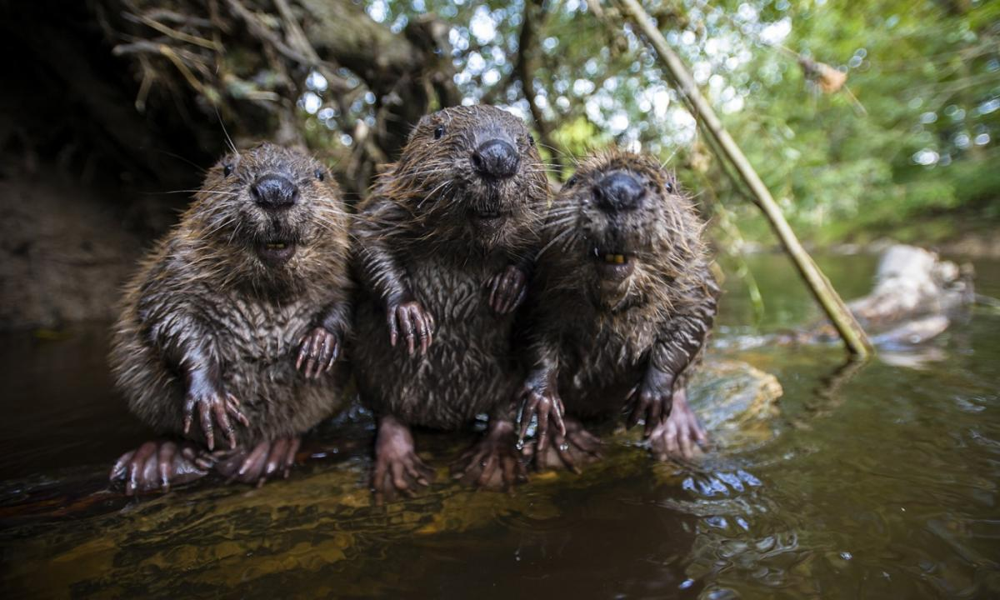
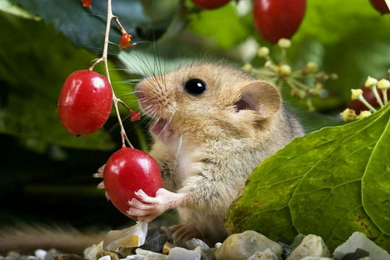
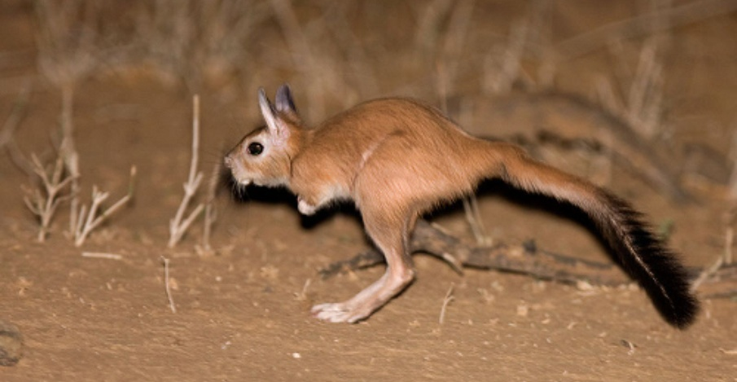

Грызуны 

-(лат. Rodentia) — самый многочисленный отряд млекопитающих. База данных Американского общества маммалогов (ASM Mammal Diversity Database, v.1.9) признаёт 35 семейств, 529 родов и 2623 современных вида грызунов (около 40 % от всех современных видов млекопитающих), а также 48 видов, вымерших после 1500 года.

# Классификация:
<<<<<<< HEAD

- Белкообразные (Sciuromorpha)

- Бhlkjkjhlkjhkjhlknkknkjnkjnrimorpha)
=======

- Боброобразные (Castorimorpha)
>>>>>>> conflict

- Мышеобразные (Myomorpha)

-

