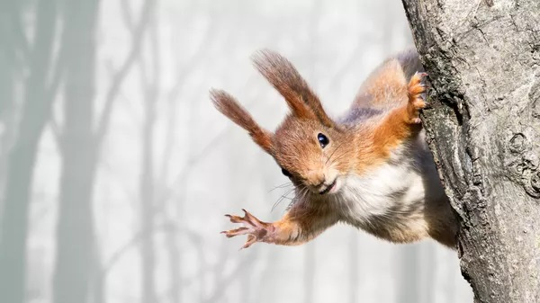

Грызуны 

-(лат. Rodentia) — самый многочисленный отряд млекопитающих. База данных Американского общества маммалогов (ASM Mammal Diversity Database, v. 1.9) признаёт 35 семейств, 529 родов и 2623 современных вида грызунов (около 40 % от всех современных видов млекопитающих), а также 48 видов, вымерших после 1500 года.

Отличительным признаком представителей отряда является наличие диастемы и по одной паре крупных резцов в верхней и нижней челюстях.

Распространены повсеместно, за исключением некоторых островов, а также Антарктиды.

# Классификация:

В справочнике Mammal Species of the World (3-е издание, 2005) выделяется 5 подотрядов грызунов:

## * Белкообразные (Sciuromorpha):

- аплодонтовые (Aplodontiidae)

- беличьи (Sciuridae), в том числе белки (Sciurus) и сурки (Marmota)

- соневые (Gliridae)

## * Боброобразные (Castorimorpha): 

- бобровые (Castoridae)

- гоферовые (Geomyidae)

- мешотчатые прыгуны (Heteromyidae)

## * Мышеобразные (Myomorpha):

- Мышовковые (Sminthidae)

- Полутушканчиковые (Zapodidae)

- Тушканчиковые (Dipodidae)

- Колючие сони (Platacanthomyidae)

- Слепышовые (Spalacidae)

- Мышевидные хомячки (Calomyscidae)

- Незомииды (Nesomyidae)

- Хомяковые (Cricetidae)

- Мышиные (Muridae)

## * Шипохвостообразные (Anomaluromorpha):

- Долгоноговые (Pedetidae)

- Шипохвостые (Anomaluridae)

- Единственный вид беличий шипохвост (Zenkerella insignis)

## * Дикобразообразные (Hystricomorpha)

- Крысиношиншилловые (Abrocomidae) 

- Землекоповые (Bathyergidae) 

- Хутиевые (Capromyidae) 

- Свинковые (Caviidae) 

- Шиншилловые (Chinchillidae) 

- Туко-туковые (Ctenomyidae) 

- Паковые (Cuniculidae) 

- Агутиевые (Dasyproctidae) 

- Лаосские горные крысы (Diatomyidae) 

- Пакарановые (Dinomyidae) 

- Щетинистые крысы (Echimyidae) 

- Древеснодикобразовые (Erethizontidae) 

- Семизубовые (Heptaxodontidae) 

- Дикообразовые (Hystricidae) 

- Нутриевые (Myocastoridae) 

- Восьмизубовые (Octodontidae) 

- Скальнокрысиные (Petromuridae) 

- Тростниковокрысиные (Thryonomyidae) -род африканских 

грызунов, выделяемых в семейство тростниковокрысиных

(Thryonomyidae). 
